# Lab 1-1: Hello World

#### Introduction to Java

---
## Lab Objectives

This is a simple warm up lab to get you familiar with using the Eclipse IDE in the supplied Virtual Machines. If you are already familiar with Eclipse, or are using your own IDE on your own machine, feel free to skip over this lab. 
- Note that the IDE used in this lab is Eclipse because it is the default used by LearnQuest in their hosted class VMs. 

If you are new to programming, this lab will help you get familiar with writing an running a simple Java application.

---

## Part One: The Application

The following is the standard "Hello World" application required by law to be the first exercise done in any introductory programming class.

```java
public class HelloWorld {
    public static void main(String []args) {
        System.out.println("Hello World");
    }
}
```

If you are new to Java, then the code may seem awkwardly verbose compared to other languages. Python, for example

```python
  print('Hello World')
```

But remember the discussion about how code is packaged in an OO language; every method or function must be contained within a class definition. 

The class `HelloWord` can be thought of as a container where you can put the one line of executable code to ensure that it actually gets executed.

Python, on the other hand, allows you to declare and use code without having to put it in any sort of container. Neither is right or wrong, Java and Python just represent two different philosophies and language design choices about how to write code.

In you are new to Java, don't worry about what all the code actually does; that will become clearer as we go through the course.
<br/>

---
<br/>

## Part Two: Using Eclipse

### _Step 1 - Start Eclipse_

Power up and log into your VM like you did the the walk through. The Eclipse icon should be pinned to the task bar. If not, then search for it among the apps.

Once you start Eclipse, it will ask you for a workspace and provide you with a default location.

You can choose whatever location you want for your workspace. One strategy is to create a working directory at the root of your C: drive, like `C:\mywork`, then create a new workspace for each module.

The workspace selection dialogue box is shown below:


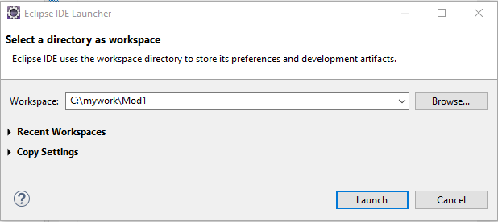

<br/>

### _Step 2 - Create a Java Project_

The first screen that shows up is the welcome screen. 

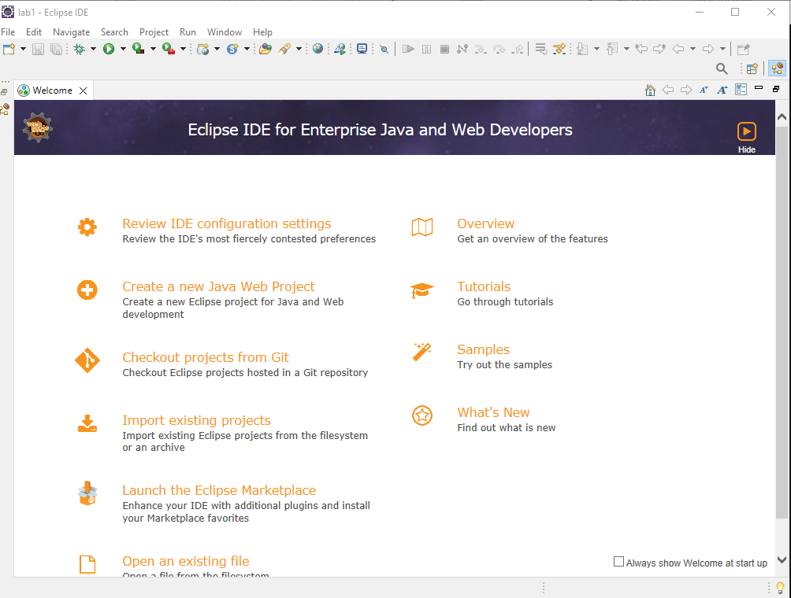

Close the screen by selecting the "x" on the "Welcome" tab.  Then you should see the main workspace window.

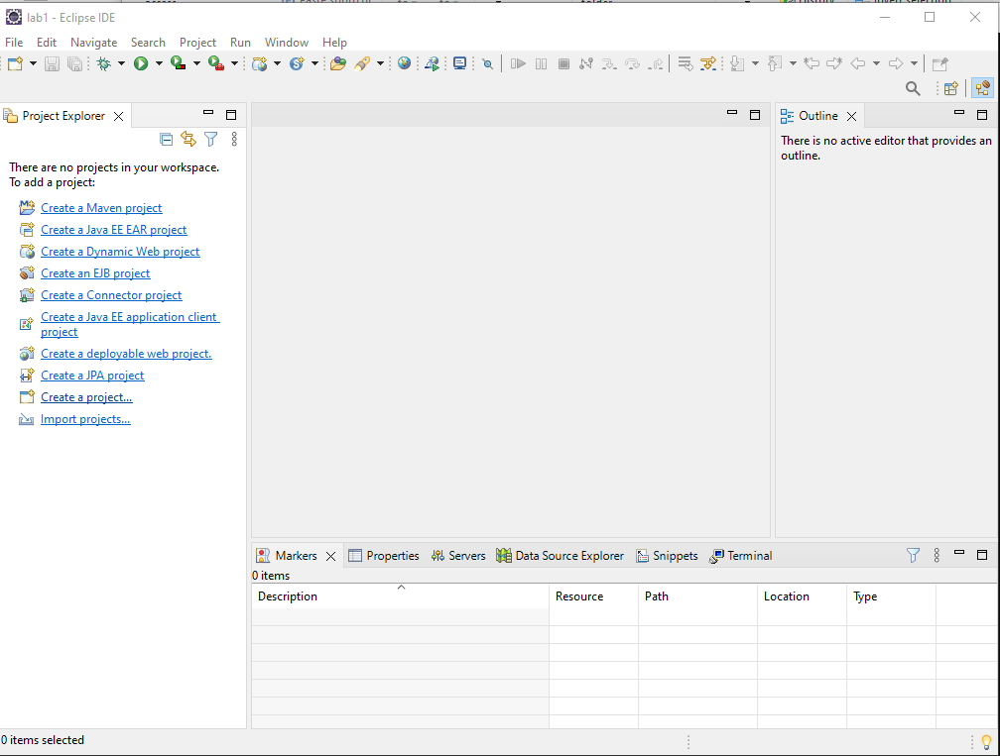

If the option to create a Java project is listed, then select it. If not, then select the option `Create a project`, which, in the screenshot, is second from the bottom of the list. In the dialogue box that appears next, select `Java Project` and select `Next`

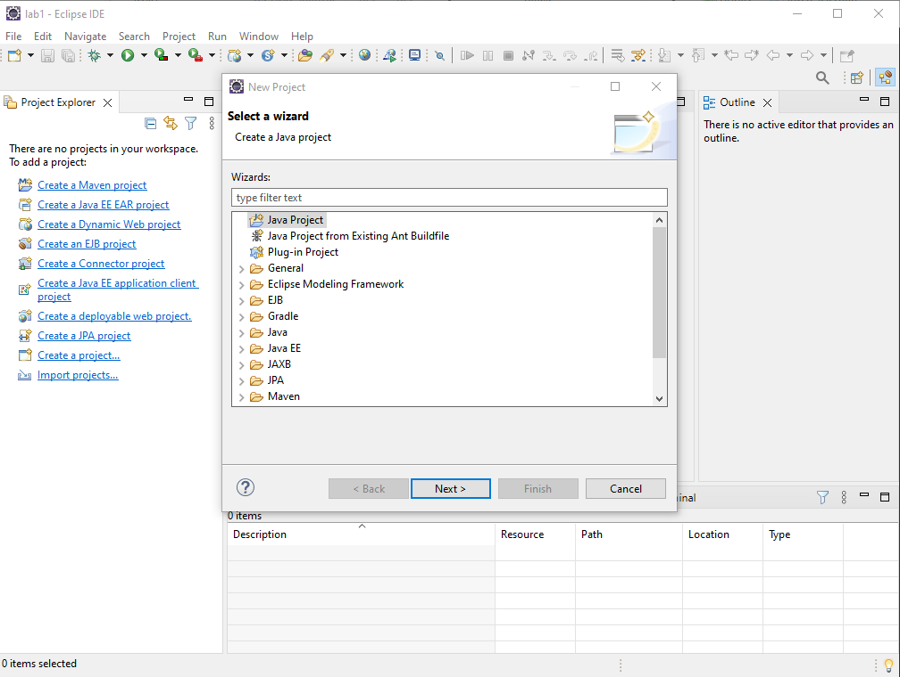

This will bring up the project specification dialogue show below.


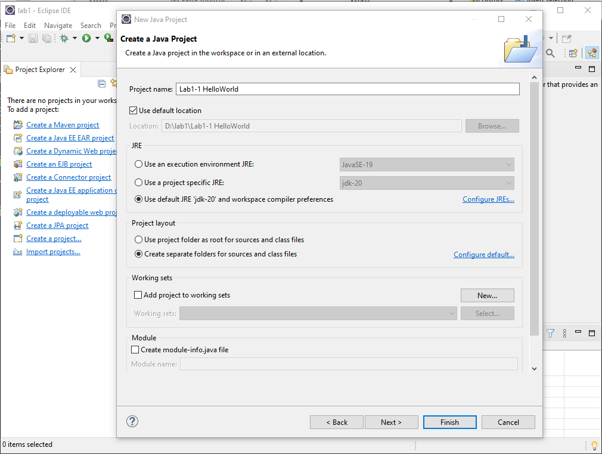

Give the project a name of your choosing, _life pro tip: make it meaningful enough so that you don't have to be constantly opening a project to figure out what the project is about._

Make the following changes to the options.

1. Under `JRE` select the last option to use the default choice since that is the version installed on your VM.

2. Under `Module` uncheck the `Create module-info.java file`. We will not be using modules in this course and it keeps the code simpler.

Once you are done, select `Finish` 

The Java Perspectives dialogue box will pop-up as shown below. Select the `Open Perspective` option

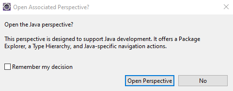

You should now see the project in the project explorer window.


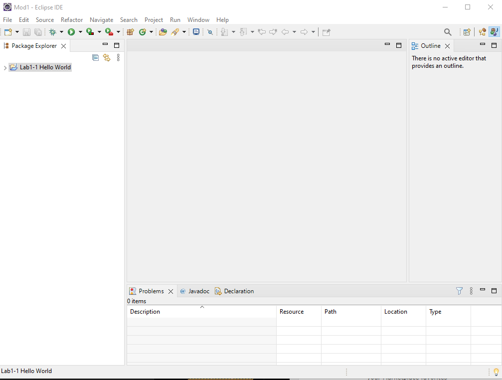


### _Step 3 - Create the Application_

First right mouse click on the project name in the project explorer, select `New` and then select `Java Class` as shown below

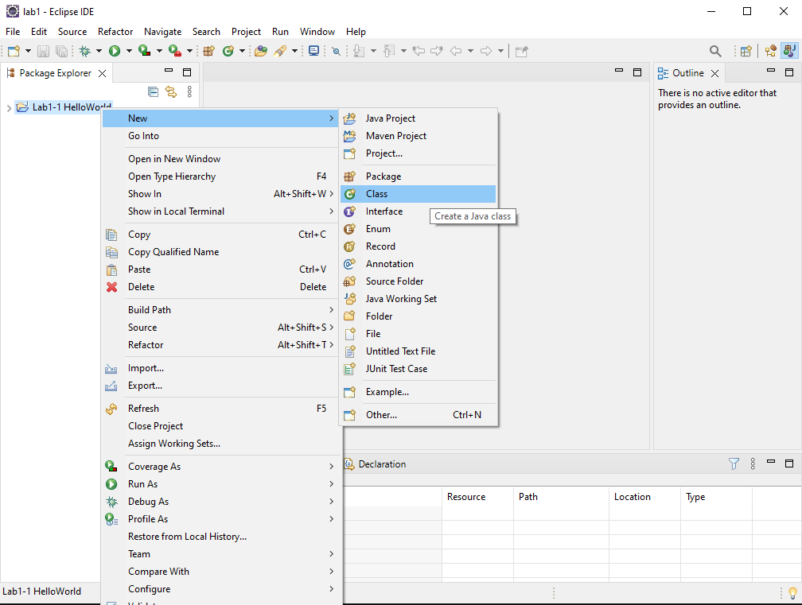


This will bring up the class specification window as shown below:


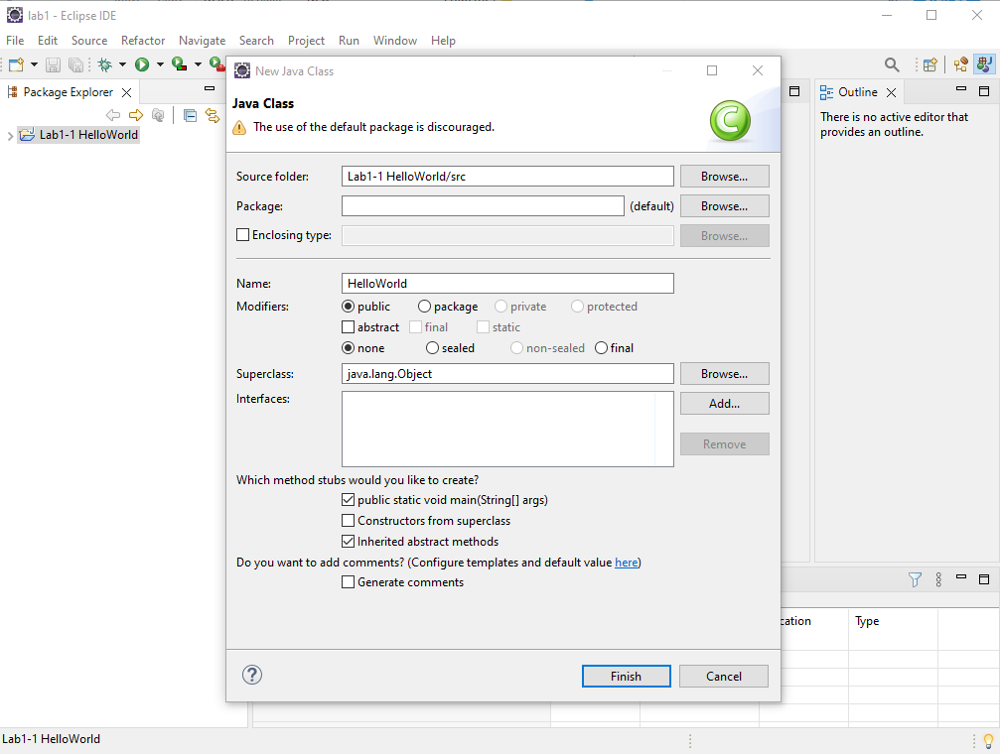

Make the following edits

1. Name the class `HelloWorld`. Java class names by convention start with a capital letter. You don't have to use a capital, but Eclipse will whine and complain if you don't.

2. In the `Which method stubs...` section, check the `public static void main(String[] args)` box. This tells Eclipse to write some boilerplate code for you.

Once you are done, select `Finish`. The following editor window and code should appear. All you have to do is add this line

```java
  System.out.println("Hello World");
```
after the helpful green comment that tells you where to add your code.


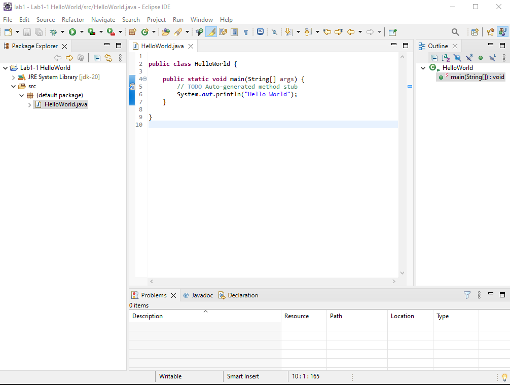

Then same your file using`ctl-s` or the file menu

### _Step 3 - Run the Application_

To run the application, either right mouse click on the code and select `Run as` and then select `Java Application` 

Or select the dropdown list from green arrow under the `Recfactor` menu option and select the `Run as` and then `Java Application` from there. This option is shown in the screen shop below 

You may see another option to run on a server, that does not apply to use and is used when building web based application.

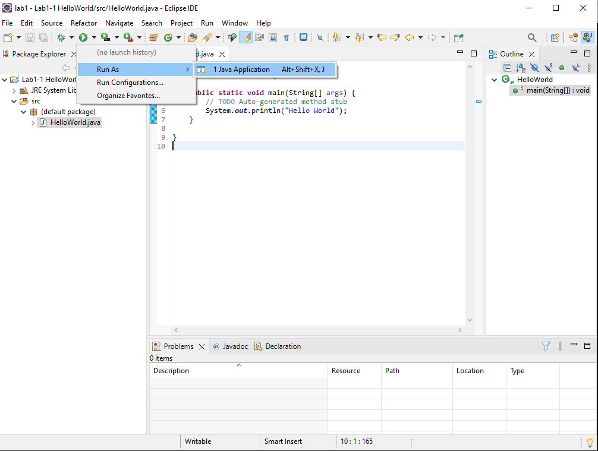

You should see your output in the console window at the bottom of the screen


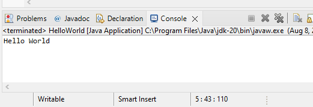

## End Lab