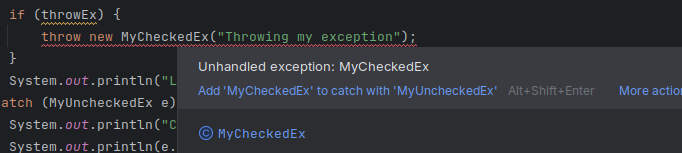

# Lab 8-1: Exceptions 

---

## Lab Objectives

In this lab, you will experiment with exception handling

---
<br/>
<br/>

## Part 1: Setup

Start a new project and create a `Runner` class with a main method as before.


<br/>
<br/>

## Part 2: Create and use an Unchecked exception

Recall that we create our own unchecked exceptions by subclassing the Java `RuntimeException`

In the same file where the `Runner` class is defined, create your new unchecked exception as shown below
- It's considered good practice to allow your exceptions to be raised with an explanatory message
- Create a constructor with a single String argument
- Since creating this constructor removes the default constructor provided by Java, we add it back.

```java
 class MyUncheckedEx extends RuntimeException {
    MyUncheckedEx(String message) {
        super(message);
    }
    MyUncheckedEx() {}
}
```
To see the exception in operation , flesh out the body of the `main()` function as shown below
- The `if` statement allows you to compare the behaviour of the code when an exception is thrown versus when it is not thrown
- The two output statements allow you to see what happens before and after the exception.

```java 
public class Runner {
    public static void main(String[] args) {
        boolean throwEx = false;
        System.out.println("Line before exception");
        if (throwEx) {
            throw new MyUncheckedEx("Throwing my exception");
        }
        System.out.println("Line after exception");
    }
}
```
Execute the code, you should see this output:

```console
Line before exception
Line after exception

Process finished with exit code 0
```

Now change the value of the boolean variable to `true` and re-run the code. You should see the following output
- Notice that execution halted after the exception was thrown
- And the program returned with an ABEND or abnormal termination error code.
- This is because an exception was thrown that was not handled

```console
Line before exception
Exception in thread "main" MyUncheckedEx: Throwing my exception
	at Runner.main(Runner.java:10)

Process finished with exit code 1
```

---


## Part 3: Handle the unchecked execution

Although we are not required to handle unchecked exceptions, we can optionally provide exception handlers for them

- This is a best practice when we know they might occur in our code
- Wrap the exiting code in a `try` block as shown
- Add a `catch` block as shown
- Add a `finally` block as shown
- Add the shown output statement after the `finally` block.

```java
ublic class Runner {
    public static void main(String[] args) {
        boolean throwEx = false;
        try {
            System.out.println("Line before exception");
            if (throwEx) {
                throw new MyUncheckedEx("Throwing my exception");
            }
            System.out.println("Line after exception");
        } catch (MyUncheckedEx e) {
            System.out.println("Caught MyUncheckedEx");
            System.out.println(e.getMessage());
        }
        finally {
            System.out.println("This is the finally block");
        }
        System.out.println("This is the line after the try-catch-finally block");
    }
}

```

Run the code without throwing an exception.
- You should see the following.
- Note the finally block executed

```console
Line before exception
Line after exception
This is the finally block
This is the line after the try-catch-finally block

Process finished with exit code 0
```

Now change `throwEx` to true and re-run. You should see the following.
- The `try` block stops executing after the exception is thrown
- The `catch` block executes
- The `finally` block executes.
- The program resumes right after the `finally` block
- The code exits without an error because the exception was handled.

```console
Line before exception
Caught MyUncheckedEx
Throwing my exception
This is the finally block
This is the line after the try-catch-finally block

Process finished with exit code 0
```

## Part 4: Checked Exception

In the same file, add the following code to create a checked exception
- We create a checked exception by subclassing the Java `Exception` class

```java
class MyCheckedEx extends Exception {
    MyCheckedEx(String message) {
        super(message);
    }
    MyCheckedEx() {}
}

```

In the main method, change the exception thrown to  `MyCheckedEx` 
- Notice that this will produce a compiler error or an error in the IDE
- This is because a checked exception is not handled.

```java 
public class Runner {
    public static void main(String[] args) {
        boolean throwEx = false;
        try {
            System.out.println("Line before exception");
            if (throwEx) {
                throw new MyCheckedEx("Throwing my exception");
            }
            System.out.println("Line after exception");
        } catch (MyUncheckedEx e) {
            System.out.println("Caught MyCheckedEx");
            System.out.println(e.getMessage());
        }
        finally {
            System.out.println("This is the finally block");
        }
        System.out.println("This is the line after the try-catch-finally block");
    }
}

```

---

Screenshot of comiler error shown below



---


Change all the references in the `main()` method form `MyUncheckedEx` to `MyCheckedEx` 

```java
ublic class Runner {
    public static void main(String[] args) {
        boolean throwEx = false;
        try {
            System.out.println("Line before exception");
            if (throwEx) {
                throw new MyCheckedEx("Throwing my exception");
            }
            System.out.println("Line after exception");
        } catch (MyCheckedEx e) {
            System.out.println("Caught MyCheckedEx");
            System.out.println(e.getMessage());
        }
        finally {
            System.out.println("This is the finally block");
        }
        System.out.println("This is the line after the try-catch-finally block");
    }
}
```

- Change the `throwEx` to `false`
- Run the code and confirm it works the same as before
- Now change it to `true` and run the code and confirm the exception handling behaviour.

```console
Line before exception
Caught MyCheckedEx
Throwing my exception
This is the finally block
This is the line after the try-catch-finally block

Process finished with exit code 0
```

---

## Part 5: Adding a general Exception handler

We normally use one catch block for every exception we expect might be thrown by our code. 
- However, because functions that have been called from within the `try` block may throw a checked exception that we didn't expect.
- We can put a type of catch-all block that catches all subclasses of the `Exception` class, whether user defined or build in.
- This has to be the last catch block because it catches all checked exceptions, even those that have catch blocks following it.
- If you try to put it before any other catch blocks, you will get a compiler error


```java
public class Runner {
    public static void main(String[] args) {
        boolean throwEx = true;
        try {
            System.out.println("Line before exception");
            if (throwEx) {
                throw new MyCheckedEx("Throwing my exception");
            }
            System.out.println("Line after exception");

        } catch (MyCheckedEx e) {
            System.out.println("Caught MyCheckedEx");
            System.out.println(e.getMessage());
        } catch (Exception e) {
            System.out.println("Unexpected Exception");
            System.out.println(e.getMessage());

        } finally {
            System.out.println("This is the finally block");
        }
        System.out.println("This is the line after the try-catch-finally block");
    }
}

```

To simulate an unexpected error, add a dummy function to the `Runner` class like this:
- Note you have to import the exception definition
- You also have to tell Java that although the exception is thrown in the `openFile()` method, it will be handled somewhere else. 
- This is done by using the `throws FileNotFoundException` note to the function definition. 
- Java would otherwise think the exception is not handled because it doesn't see a handler in the same scope that is throwing the exception.
- Hint: Remove `throws FileNotFoundException` and note the error message.

```java
import java.io.FileNotFoundException;


public class Runner {
    public static void main(String[] args) {
        boolean throwEx = true;
        try {
            System.out.println("Line before exception");
            Runner.openFile(throwEx);  // <-- add the function call
            if (throwEx) {
                throw new MyCheckedEx("Throwing my exception");
            }
            System.out.println("Line after exception");

        } catch (MyCheckedEx e) {
            System.out.println("Caught MyCheckedEx");
            System.out.println(e.getMessage());
        } catch (Exception e) {
            System.out.println("Unexpected Exception");
            System.out.println(e.getMessage());

        }
        finally {
            System.out.println("This is the finally block");
        }
        System.out.println("This is the line after the try-catch-finally block");
    }

    static public void openFile(boolean x) throws FileNotFoundException{
        if (x) throw new FileNotFoundException("From somewhere in the stack");

    }
}

```

This should produce teh following output:

```console
Line before exception
Unexpected Exception
From somewhere in the stack
This is the finally block
This is the line after the try-catch-finally block

Process finished with exit code 0

```


---

## End Lab